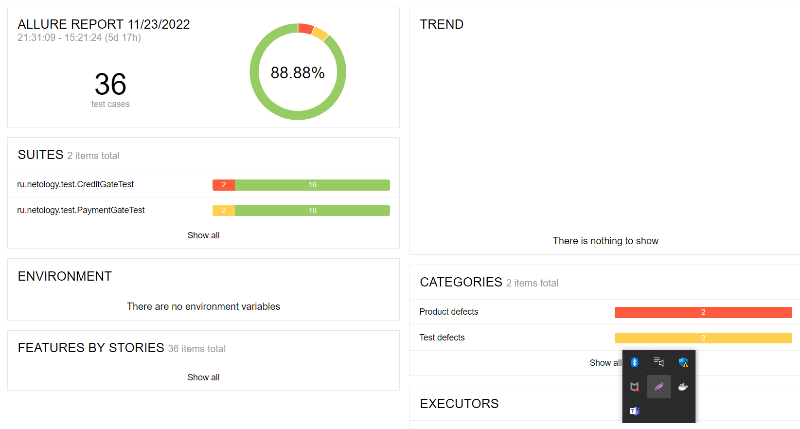

# Отчётные документы по итогам тестирования

## Краткое описание
По результатам проведенной работы по дипломному проекту была проведена автоматизация тестовых сценариев сервиса "Путешествие дня"

1. Тесты на пустые поля формы заявки
2. Тесты на заполнение полей формы заявки используя классы эквивалентности
3. Тесты на получения статуса заявки в базе данных
4. Тесты на получение ответов сервера

Были обнаружены следующие дефекты:

1. [После заполнении и отправки формы валидными данными, система выдает ошибку для "Оплата по карте"](https://github.com/Ulia95/Diploma/issues/1)
2. [При заполнении поля "CVC/CVV" данными "000", отсутствует уведомление о неверном формате для "Кредит по данным карты"](https://github.com/Ulia95/Diploma/issues/2)
3. [При заполнении поля "CVC/CVV" данными "000", отсутствует уведомление о неверном формате для "Оплата по карте"](https://github.com/Ulia95/Diploma/issues/3)
4. [Уведомление об успешном выполнении операции банком при внесении данных отклоненной карты для "Кредит по данным карты"](https://github.com/Ulia95/Diploma/issues/4)

## Количество тест-кейсов
 
Протестировано 36 тест-кейсов

## Процент успешных и не успешных тест-кейсов

 - успешных: 32
 - неуспешных: 4

## Общие рекомендации

 - Составить подробные требования
 - Устранить найденные дефекты
